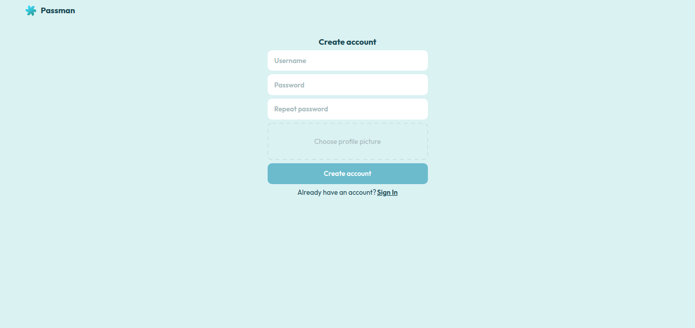
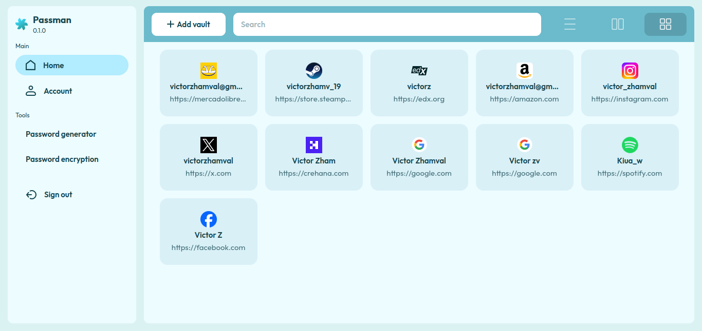

<div align="center">
   
  <h1>Passman</h1>
  
  
  <p>Passman is a password manager with encryption and generation tools.</p>
</div>

## Table of contents

- [Built with](#built-with)
- [Features](#features)
- [Installation](#installation)
- [Setup database](#setup-database)
- [Setup server](#setup-server)
- [Setup client](#setup-client)
- [Author](#author)
- [Version](#version)
- [License](#license)

## Built with


## Features

Auth: 

* Login/registration system
* JWT validations

Vaults:

* Create, edit and delete vaults
  * Title
  * Username
  * Password
  * Website url
  * Description (optional)

* Vault display types (item and grid)

User:

  * Change account password
  * Change account profile picture
  * Delete account profile picture
  * Delete account 

Tools:

* Encrypt/decrypt password (AES)
* Generate password with custom length and params:
  * Use lowercase
  * Use uppercase
  * Use numbers
  * Use symbols

## Installation 

1. Clone this repo

```
git clone https://www.github.com/victorzhamval/passman
cd passman
```

## Setup database

1. Download postgreSQL [here](https://www.postgresql.org/download/)

2. Create a database called passman

```
  CREATE TABLE passman;  
```

3. Create tables, full file [here](server/db/passman.sql)

```
CREATE TABLE users (
	user_id UUID PRIMARY KEY NOT NULL,
	username VARCHAR(128) NOT NULL UNIQUE,
	password VARCHAR(255) NOT NULL,
	description VARCHAR(128) DEFAULT 'Add a description',
    profile_image VARCHAR(128) NOT NULL,
	created_at timestamp DEFAULT CURRENT_TIMESTAMP
);

CREATE TABLE vaults (
	vault_id UUID PRIMARY KEY NOT NULL,
	title VARCHAR(255) NOT NULL,
	username VARCHAR(255) NOT NULL,
	password VARCHAR(255) NOT NULL,
	site_url VARCHAR(255) NOT NULL,
	description VARCHAR(255) DEFAULT '/',
	is_pinned BOOLEAN DEFAULT FALSE,
	created_at timestamp DEFAULT CURRENT_TIMESTAMP,
	edited_at timestamp DEFAULT NULL,
	user_id UUID NOT NULL,
	FOREIGN KEY (user_id) REFERENCES users(user_id)
);
```

## Setup server

1. Go to server root

```
cd server
```

2. Install packages

```
yarn
```

3. Create .env file and add environment variables

---server<br>
&nbsp;&nbsp;&nbsp;&nbsp;&nbsp;&nbsp;&nbsp; |___.env

```
DB_NAME = passman 
DB_HOST = localhost
DB_PORT = 5432 # By default, PostgreSQL uses port number 5432
DB_USER = <your-user>
DB_PASSWORD = <your-user-password>

SERVER_HOST = localhost
SERVER_PORT = 4000

key to sign token, you can replace it with your own secret key.

JWT_SECRET_KEY = f84284b2736e5925a15ecc8eaeebae7a6c9732c6f149d47d371923b1b1509fa60b24bd90a8c2a67a
```

4. Run server

```
yarn start
```

## Setup client

1. Go to client root

```
cd client
```

2. Install packages

```
yarn
```

3. Create .env file and add environment variables

---client<br>
&nbsp;&nbsp;&nbsp;&nbsp;&nbsp;&nbsp;&nbsp; |___.env

```
REACT_APP_API_URL = http://localhost:4000/ # your server path
REACT_APP_VERSION = 0.1.0
```
4. Run client

```
yarn start
```

## Author

Victor Zhamval / victorzhamval@gmail.com / [X](https://x.com/victorzhamval) / [Discord](https://discordapp.com/users/1199881427353878559)<br>

## Version

0.1.0

## License

MIT
